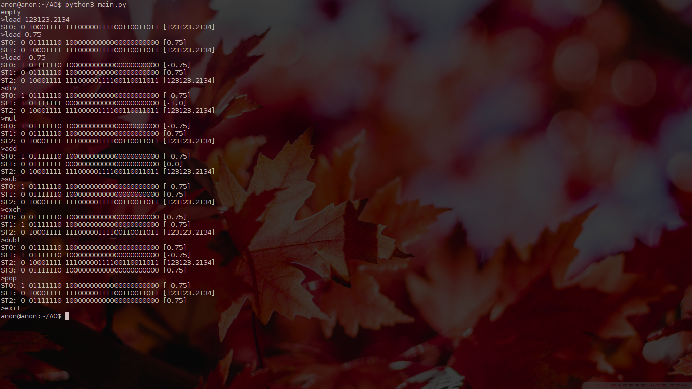

<h3> Description </h3>

<b> 1 bit - sign </b>
<b> 8 bits - bias </b>
<b> 23 bits - mantissa </b>
(numbers are shown in <b>IEE754</b> format)

<h6> Allowed operations </h6>
<ul>
	<li> <b> load </b> - load number to ST0 </li>
	<li> <b> add </b> - ST1+=ST0 </li>
	<li> <b> sub </b> - ST1-=ST0 </li>
	<li> <b> mul </b> - ST1*=ST0 </li>
	<li> <b> div </b> - ST1/=ST0 </li>
	<li> <b> exch </b> - swap(ST1, ST0) </li>
	<li> <b> dubl </b> - add ST0 to stack one more time </li>
	<li> <b> pop </b> - pop ST0 from stack </li>
	<li> <b> exit </b> - terminate the program with exit code 0 </li> 
</ul>

